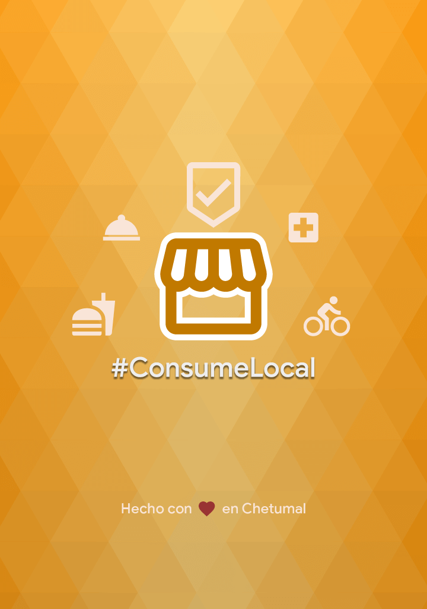

# consumelocal

## ¿Porqué ConsumeLocal?
Surge como un proyecto para desarrollar un directorio de comercios locales y apoyar a la difusión de los negocios que se encuentran en activo a pesar de la pandemia COVID-19.
- Tuvimos la oportunidad de participar en Hack The Crisis MX en la vertical de "Reactivación Económica" con el apoyo de: Brenda Elizabeth García López - COAH / Carlos Alberto García Hernández - CDMX / Gregorio Ederli Salazar Loria - QROO
- [Pitch ConsumeLocal HackTheCrisisMX](https://youtu.be/PsSD8Z5Qjco)

## ¿Porqué con Flutter?
- Por el hecho de querer aprender sobre este SDK y las maravillas que se pueden construir. ¡Tan sólo en una semana nació esta app!
- Creo que tiene mucho potencial y que debemos aprender de Dart 💙 

### Primeros Auxilios:

- [Documentación en linea](https://flutter-es.io/docs)
- [Lab: Escribe tu primera app en Flutter](https://flutter-es.io/docs/get-started/codelab)
- [Cookbook: Ejemplos de Flutter](https://flutter-es.io/docs/cookbook)

## Contribuciones

Me gustaría agradecer a todas las personas que han hecho posible esta primera versión de ConsumeLocal en especial al GDE Flutter [Argel Bejarano](https://github.com/Arkangel12) por su feedback y ánimos para aprender.

No dudes en unirte, indica algun problema (issue) que hayas detectado o alguna característica adicional y por qué no hasta una totalmente nueva app!
Pero primero te invito a leer el archivo [CONTRIBUTING](CONTRIBUTING.md) para que conozcas de que forma hacerlo.

## Licencia

Todo el código en este repo esta bajo la licencia MIT.
